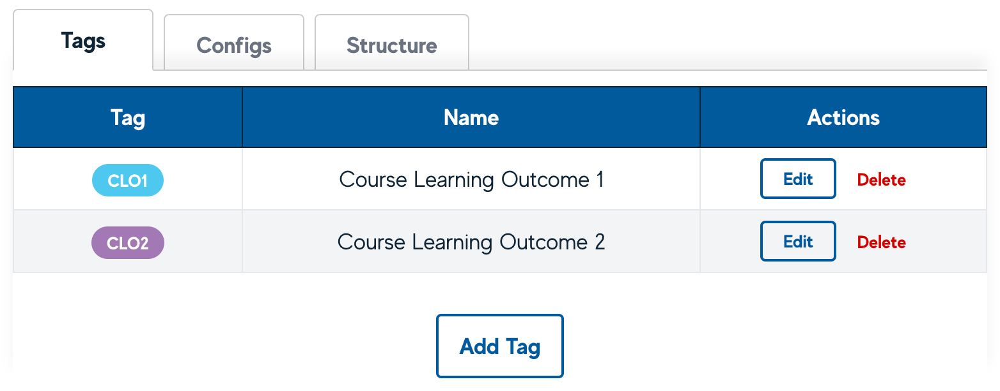
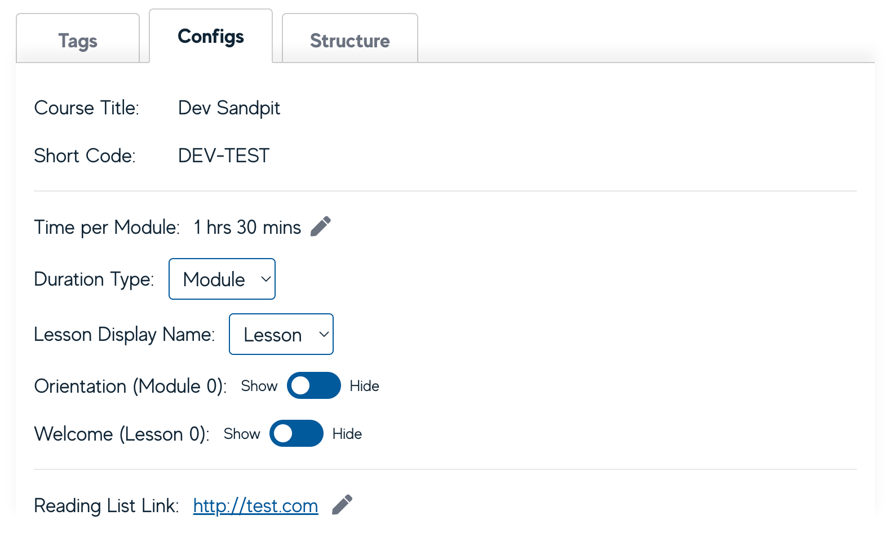
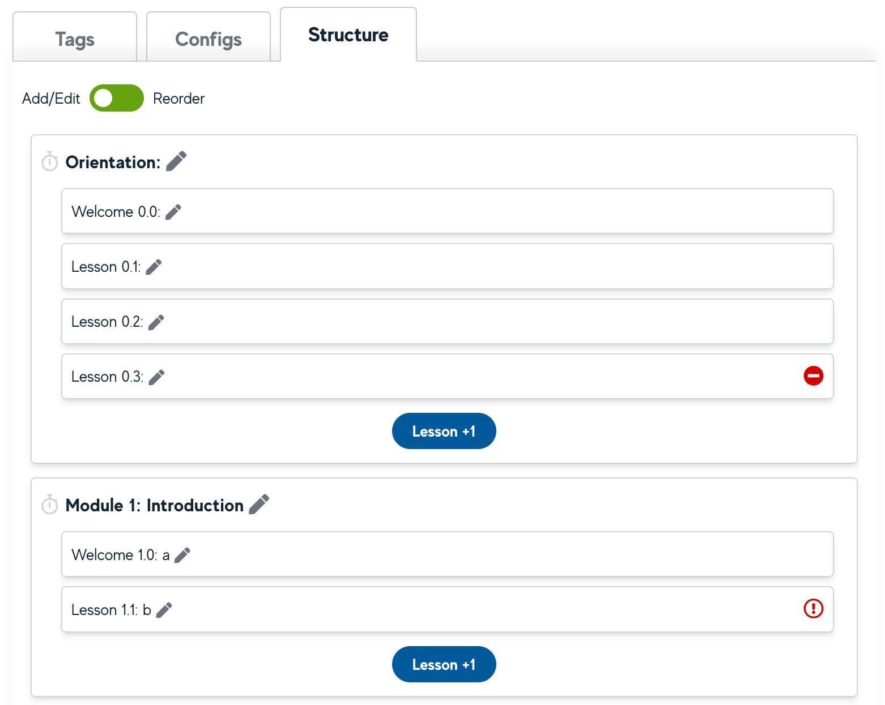

# Course Settings (Admin)

Admin users can view and modify course configuration settings in the Course Config view. Here, the Course Readings list link can also be added and edited, which provides all users with a hyperlink to the Course Readings from the Dashboard.

## Tags

Admin users can create/edit/remove tags under the Tags tab in the Course Settings view. Each tag can have a display name and a colour assigned to it. Enrolled users can then attach existing tags to blocks.

## Configs

Course-level configurations can be viewed and modified under the Config tab. Here, admin users can:

- change the default budget time per module

- change duration type (Module, Week, Section)

- change lesson display name (Lesson, Activity, Part, Page, Topic)

- show/hide Orientation (Module 0)

- show/hide Welcome (Lesson 0)

- add/edit the Course Readings list link, which provides all users with a hyperlink to the Course Readings from the Dashboard.

## Structure

From the Structure tab in Course Settings, the Admin can add lessons, edit the names of modules/lessons, and override budget time for specific modules with the **Add/Edit mode**; and when switched to **Reorder mode**, lessons can be dragged and dropped into other Modules.

