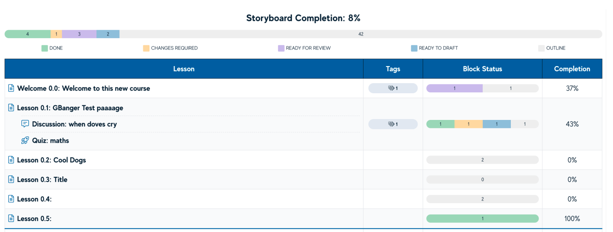
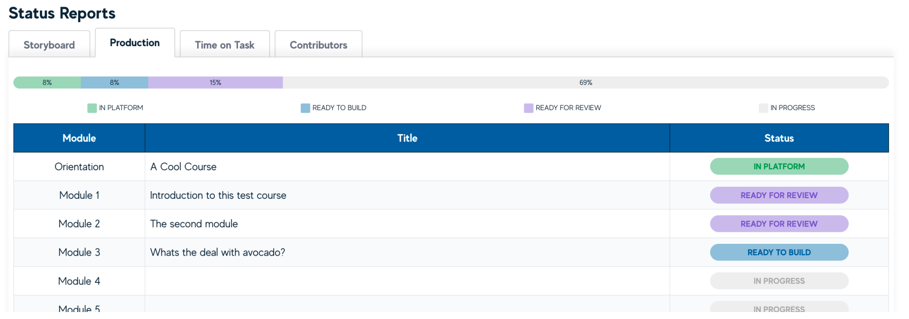
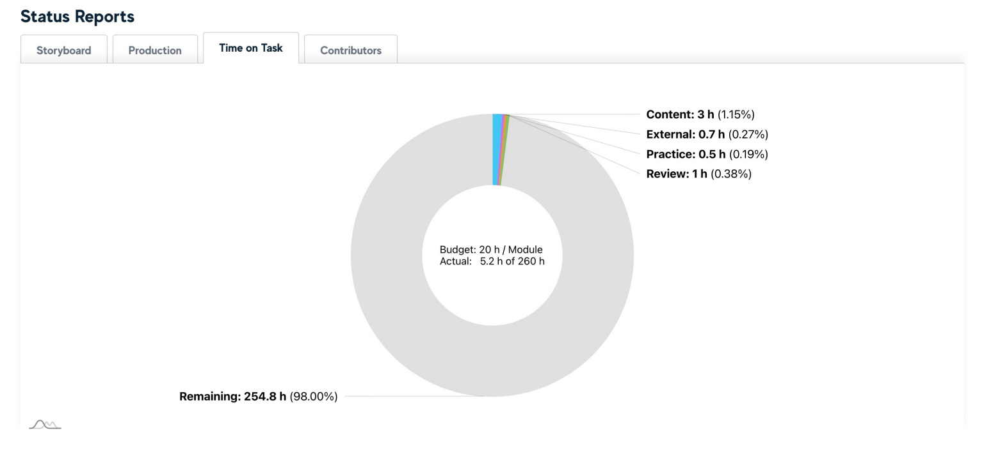
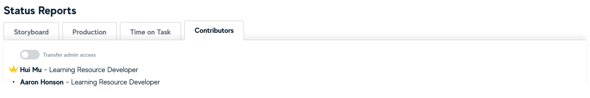
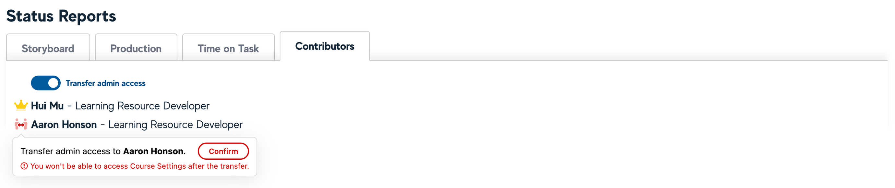

# The Dashboard

The Dashboard provides all users with a snapshot of course development progress. The **Storyboard Completion %** is a total completion of all available Blocks, while the **Lesson Completion** is a total completion of Blocks within each Lesson. The **Block Status** is a visual indicator of the status of all Blocks within each Lesson and is summarised at a Course level above.

## Production

The Production tab of the Dashboard provides a module level production status for the course. These statuses are set within the Module view.

## Time on Task

The Time on Task tab of the Dashboard provides a report of the total student Time on Task across the course.

## Contributors

The Contributors tab provides a list of all users enrolled in the current course.

If you are the course admin and would like to transfer your access to another enrolled user, you can turn on the “Transfer admin access” toggle and click on the icon next to the user who is the new admin.

