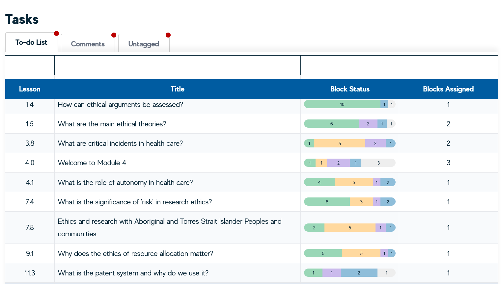
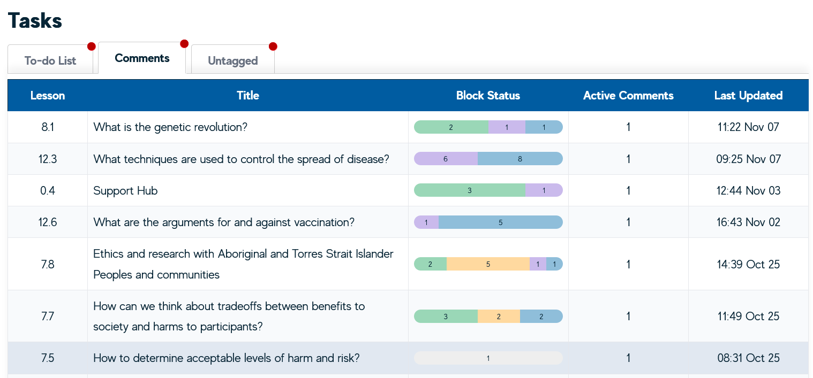
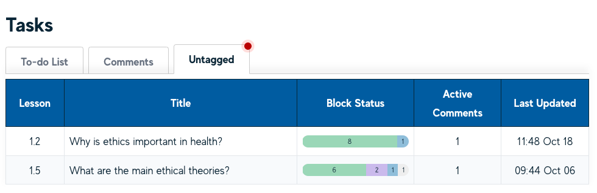

# The Dashboard

## Dashboard 
The Dashboard provides all users with a snapshot of course development progress. The **Storyboard Completion %** is a total completion of all available Blocks, while the **Lesson Completion** is a total completion of Blocks within each Lesson. The **Block Status** is a visual indicator of the status of all Blocks within each Lesson and is summarised at a Course level above.

### Production

The Production tab of the Dashboard provides a module level production status for the course. These statuses are set within the Module view.

### Time on Task

The Time on Task tab of the Dashboard provides a report of the total student Time on Task across the course.

## Tasks View

The Smart Storyboard has a view for seeing your work to do - these either take the form of blocks you are assigned to as **Tasks**; **Comments** you have been tagged in, as well as any **Unassigned** comments that may pertain to your work.

### Tasks

Under the Tasks tab, you’ll see the blocks you have assigned to you as well as how many of them there are. Clicking on a table row here will take you to that lesson.

### Comments

The Comments tab contains a table of any comment you are tagged in as well as when that comment was last updated. As above, clicking on an entry here will take you to the lesson that contains your comment. When on that page, you should see the comments icon in red for any block that relates to you.

### Untagged

The **untagged** tab contains a list of the comments in the course that are unassigned or otherwise not tagging someone else in them. This helps to review any comments that may have meant to have tagged someone or be general thoughts or processes inside the course authoring stage.

