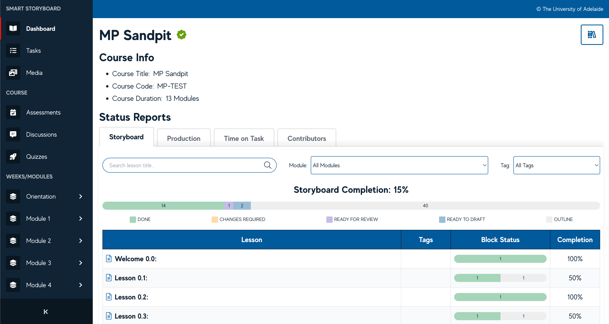

# 👋 Welcome to Smart Storyboard

The **Smart Storyboard** is a cloud based development tool which aims to replace word based documents as the primary means of capturing and developing learning material for online courses.

The Smart Storyboard has been designed to add meaningful data to content Lessons and Blocks which can be used to manage the progress of course development in ways previously not possible.

The Smart Storyboard generates a number of reports from the data to enable multidisciplinary teams to more efficiently and effectively contribute to the course development at key moments through the process.

The Smart Storyboard enables the implementation and integration of Learning Patterns into the Learning Design Process.

The Smart Storyboard allows **Learning Designers** and **SMEs** to visualise their course materials in a near-to-complete state before the course is finalised. The Smart Storyboard allows truly agile course development to occur.

## Getting Started

The first step to getting started is to [create an account](./using-ssb/account.md) if you don't have one, else, [enrol in your course](./using-ssb/enrolment.md) and start creating your first Lesson.