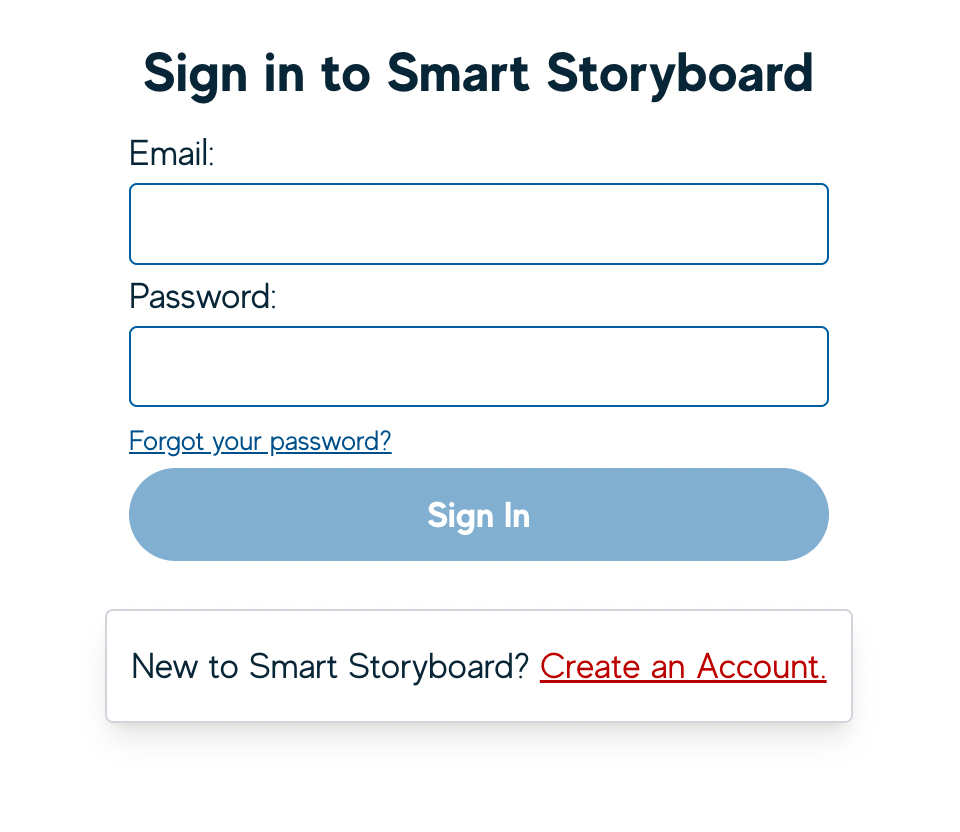
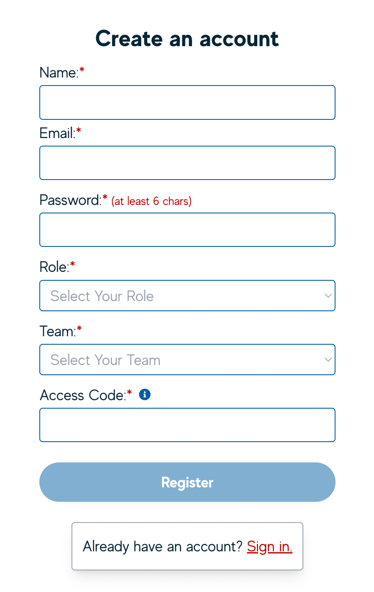
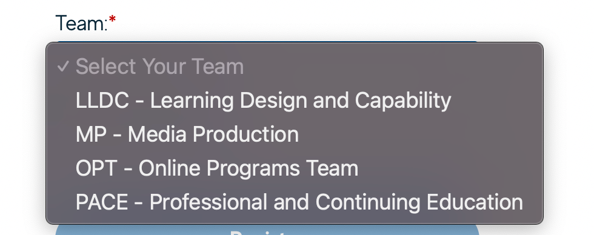

# Account creation and management

You can access the Smart Storyboard on our [Media Production GitHub hosted environment](https://mediaproduction.adelaide.edu.au/smart-storyboard/#/ "https://mediaproduction.adelaide.edu.au/smart-storyboard/#/").

On your first time accessing the tool, you’ll be prompted to log in or create an account. If you already have an account, log in using your account details.

## Creating an account

To use the **Smart Storyboard**, you will need an account and this is created inside the tool itself - it does not use nor is it tied to your existing university account, though we do encourage you to use your @adelaide.edu.au email address.

:::info
**Speak, Friend, and Enter**  
To get access to the tool, you _**will**_ need a special access code. If you don’t have this, get in touch with the Media Production team!
:::

Sign up using your **full name**, your university email and a secure password. You also should make sure you assign yourself the correct role and team:

### Roles

|Role| Description  |
|--|--|
| Course Author (CA) | The SME or academic role for the course. |
| Learning Designer (LD) | The learning designer(s) involved in the course. One of these would also be an admin or lead learning design role, but that’s something that gets sorted out during initial course setup. |
| Course Builder (CB) | Course Builder role from the Media Production team - will be building the course and performing some graphic design tasks. |
| Learning Resource Developer (LRD) | Learning Resource Developer from the Media Production team - will be creating bespoke graphics, interactives, some course build and be involved in experience design. |
| Video Producer (VP) | Role for the Video team inside Media Production |
| Coordinator (CO) | A passive role for Project and Program Coordinators to view information |
|Reviewer (RV)  | A passive role for content reviewers to be able to view content. |

### Admins

Any creator role can become an Admin of a course. It would primarily be the Lead Learning Designer (LD) on each course. There can only be one (1) Admin role in any course to ensure that we avoid any possible data loss or corruption.

Admins have access to the Course Settings menu, where they can:

-   Add and Edit Tags

-   Adjust Course Configuration

-   Edit and Re-order the Course Structure.

## Teams

Teams in the Smart Storyboard is a way of accessing/viewing courses at a group level. Both Smart Storyboard Users and Courses are added to Teams. A User can be added to multiple Teams and therefore access more courses.

Users select a Team upon account creation.

_Additional teams can be added by the Media Team as necessary._
