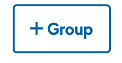
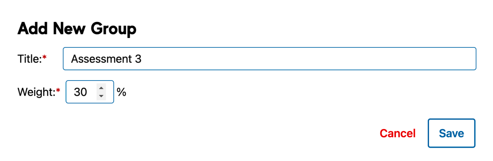
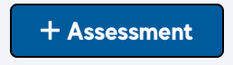
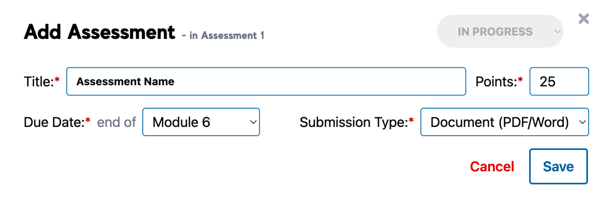
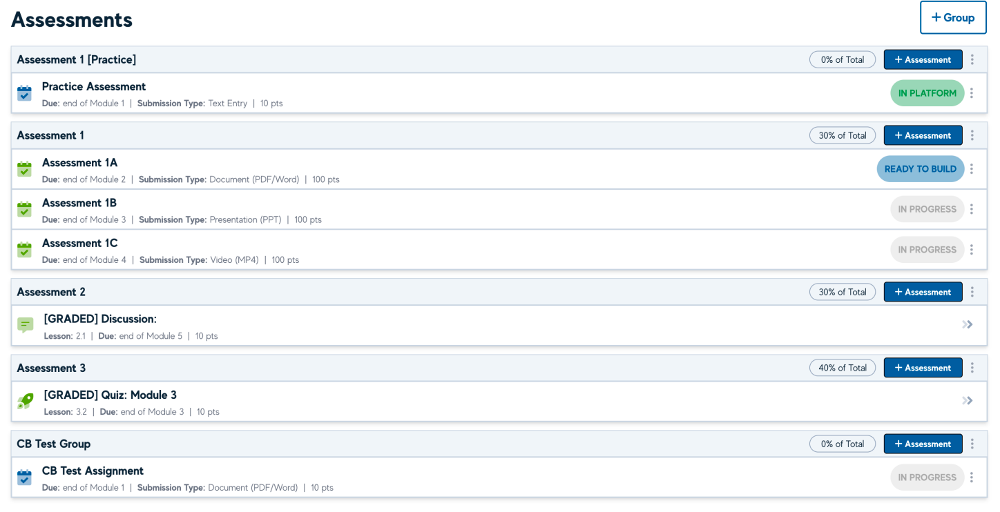
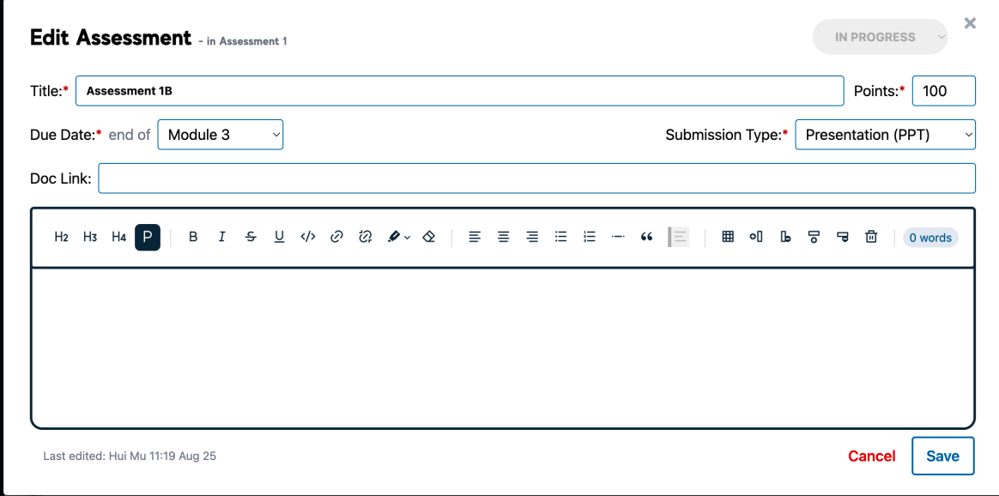

# Assessments

To add an Assessment, you first need to an an **Assessment Group**. Each Group has a weighting which should total to 100% across all items.

To add a Group, click on the ‘+Group’ button and add the Group _Title_ and _Weighting_. Assessment Groups with 0% weighting will act as formative.

You can now add Assessments to each Group by clicking the ‘+Assessment’ button and fill out the relevant Assessment information including Due Date and Submission Type.

## Assessments View

All Assessments can be viewed in the Assessments view, including any Discussions and Quizzes that have been marked as Graded.

## Adding Assessment Information

To add Assessment information, click on the there (3) dots against an Assessment item to open the Edit Assessment modal. Assessment brief information can be added by linking an external document or Canvas link in the Doc Link field, or by using the WYSIWYG editor provided.

