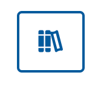

# Course enrolment and navigation

## Viewing a course

The first time you use the Smart Storyboad, you will need to select a **Course** on the Smart Storyboard Dashboard. If you are not part of a team, you will not see any courses and will need to contact the Media team to be added.

To change the course when you are already inside a course, go to the Dashboard and click on the ‘Change Course’ button:

## Course enrolment

While Teams allows access to courses in a “view only” way, to edit and contribute to a course, Users will need to enrol into a course.

To enrol into a course which you have selected, go to the Dashboard and click on the ‘Enrol’ button next to the course name:

Once you are enrolled, the enrolled icon will display:

## Adding a new course

To add a new course to the Smart Storyboard, send an email to the Media team with the following information:

-   Course Name
-   Course Code (optional)
-   Duration Type (Module/Week/Section)
-   Lesson Display Name (Page/Lesson/Part/Topic/Activity)
-   Hours per Module/Week/Section
-   Number of Modules/Weeks/Sections.

Once created, the Media team will respond to let you know.

## Navigation Items

**Reports**

These items at the top of the navigation hold the Dashboard (the home page of the course), your tasks (blocks and comments you have been assigned) and the Media list (a list of all of the media assets for this course).

**Course Elements**

These items contain the course content elements that are different to the Learning content during the weekly learning journey - Assessments, Discussions, Quizzes.

**Modules**

These items allow you to navigate to Modules/Lessons inside the course. Each module dropdown will expand to show the Lessons/Pages inside that module.

**User details**

These items will let you see your profile, change course settings (if an admin of the course) and access the admin page (if a Smart Storyboard Admin)

