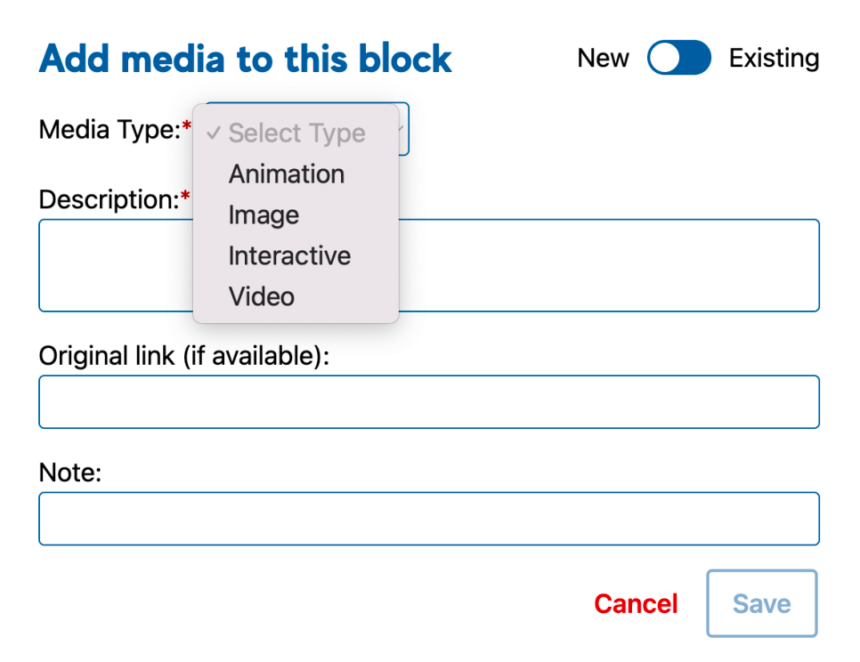
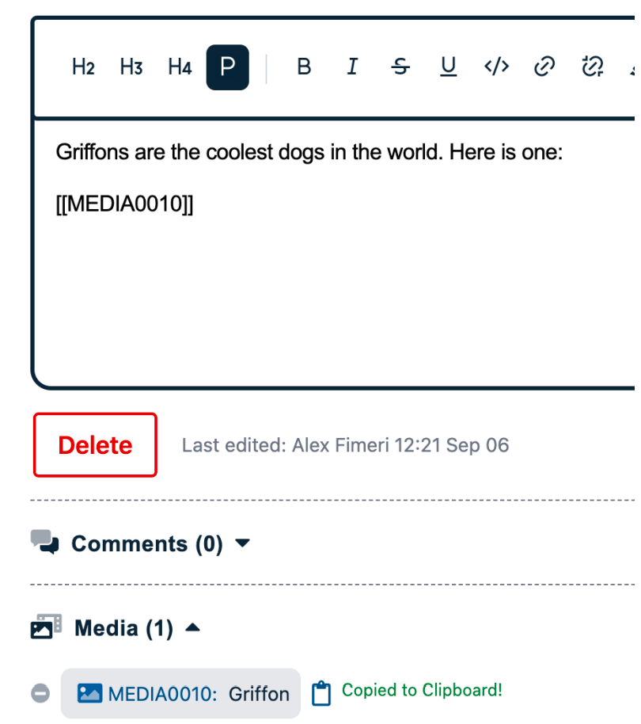
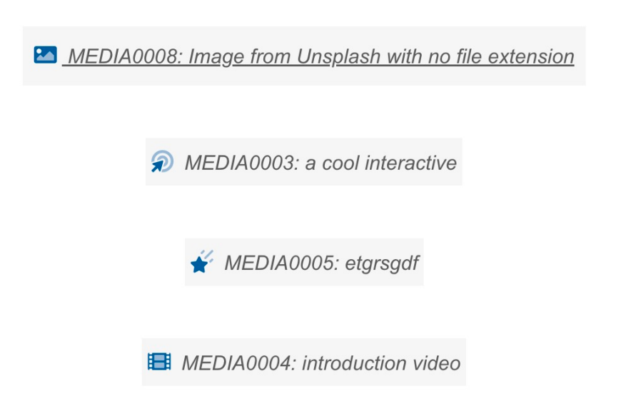
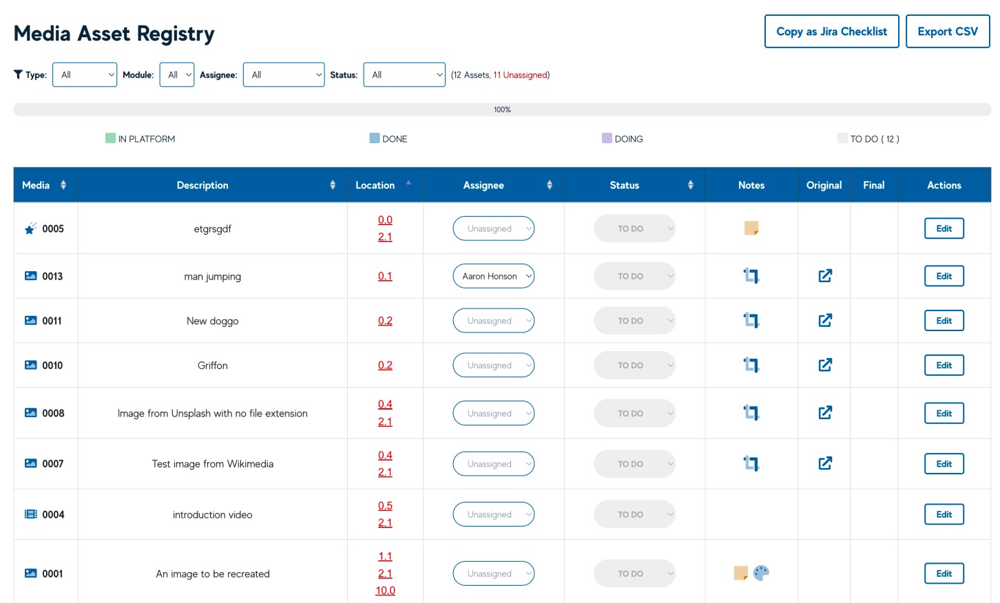

# Adding Media
:::info
This is for the LD/SME-focused documentation. For the Media Production and Course Build-oriented documentation on working with Media, this can be found in our internal Confluence page.
:::

## Media

Media can be added to any Block in the Smart Storyboard. Users are required to add information about each Media item in the modal popup, including:

- Media Type
- Whether the media is New or Existing
- A Description of the media
- The Original link (e.g., to a Wikimedia/Google image)
- A note to the media team about what is required.

Once a Media item has been created, Users can use the Media short code to add that Media to its position in the Block. The short code can be copied from the Media item in the list (e.g., [[MEDIA0010]]):

If the Original (or, later, after the LRDs have made a new version of the asset, Final) link of the Media asset is an image, it will now display in the Lesson view as a preview.

For other media types or images that are not direct links to the .png/.gif/.jpg file, these will display with the name and an icon.

## Media Asset Registry

The Media Production team uses the **Media Asset Registry** to review the media items in the course and takes the form of a major part of our workflow. We primarily use this to develop content ahead of the Course Build.

