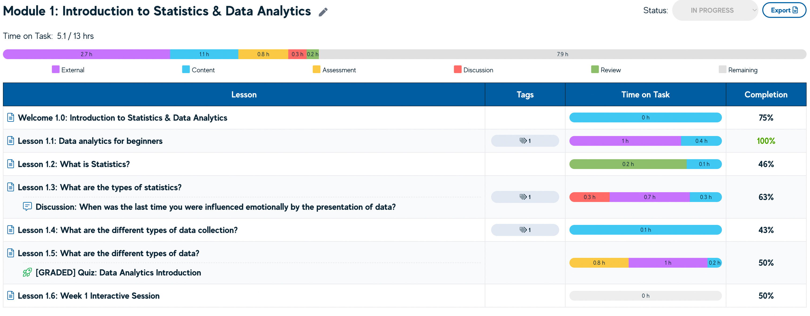
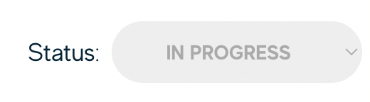
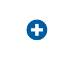
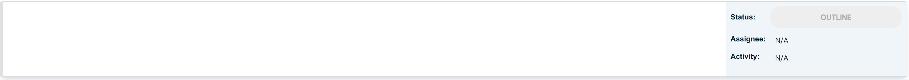
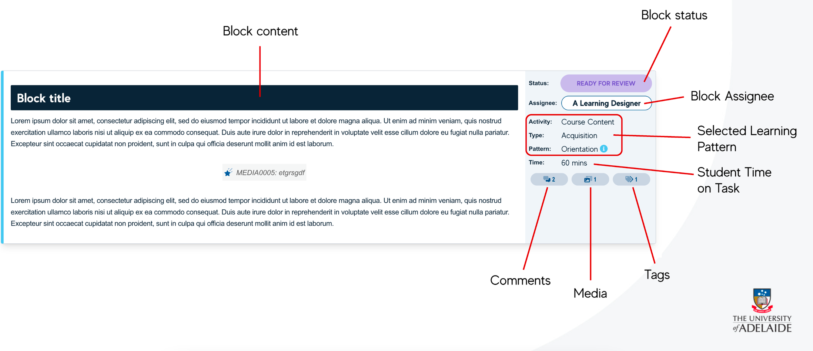
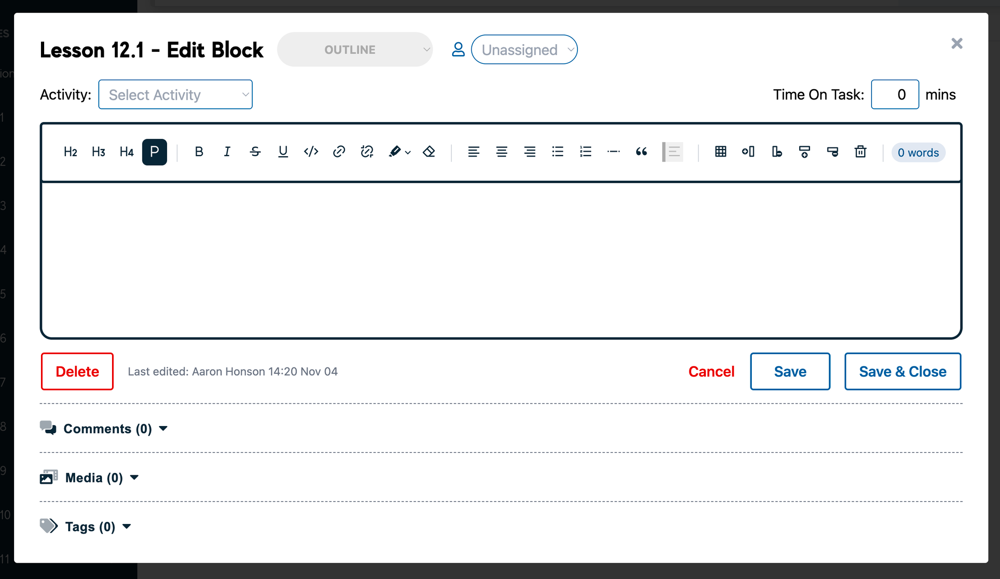
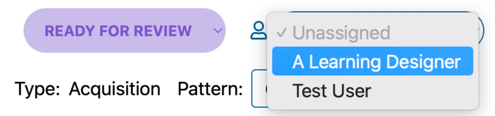
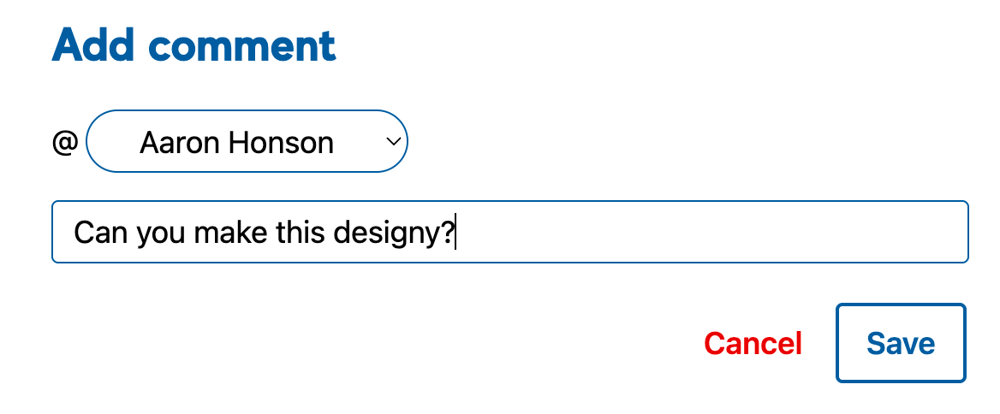
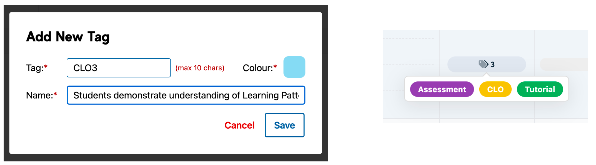

# Modules, Lessons & Blocks

## Module View

The Module View, Users are able to update the Module name and Production Satus. The Module View provides users with a report of all Lessons in that Module along with the total allocated Student Time on Task.

### Module Statuses

The Module Status is used to move work through the production process.

| Status                                               |Description  |
|------------------------------------------------------|--|
| In Progress                                          | The default status while content is being developed. |
| Ready for Review | Content is complete and ready for internal/peer review. |
| Ready to Build                                       | All content, including associated media items are ready for production and platform. |
| In Platform                                          | All content is build and in the LMS ready for final review. |

_Module status **does not impact** on the overall course completion %._

## Lesson View

The **Lesson View** page represents a page inside of a Learning Management System (typically Canvas/MyUni). The Lesson View in the Smart Storyboard can be viewed in two (2) modes:

-   **Add/Edit:** where each Block can be clicked on to edit

-   **Preview:** to see each Lesson in a ‘view only’ display

Users can add new blocks by clicking on the + icon:

This will create a new empty block:

## About Blocks

**Blocks** are chunks of content, broken up by Learning Pattern rather than content type. A Block can contain ultiple mediums, but only one (1) Learning Pattern.

From the Lesson view, all Blocks for that Lesson can be seen with specific data available from that view.

Clicking on this block (while in edit mode) will bring up the Block editing screen.

## The Block View

Inside the Block editing view, you can add comments, media and tags to the block below the content and adjust the status/settings.

### Block Status and Assignee

The intention of Block Status and Assignee is to manage work between Learning Designer and Course Author. There are five (5) statuses on a Block, each status has a designated assignable role type.

|Status| Responsibility (i.e. Who does this block currently sit with?)  |
|--|--|
| Outline | Learning Designer |
| Ready to Draft | Course Author |
| Ready for Review | Learning Designer |
| Changes Required | Course Author |
| Done | - |

### Comments

Comments provide a way to leave feedback against a block and tag another user in the process. Comments can be edited, reassigned and marked as complete once resolved.

### Tags

Tags in the Smart Storyboard can be used to label and categorise work at a Course level. Tags can be added by the Lead Learning Designer (Admin role) and then added by all enrolled users in the course.

Tags are added in the Block view and can be seen in the Dashboard view.