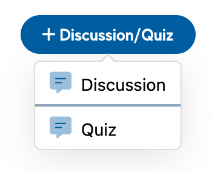
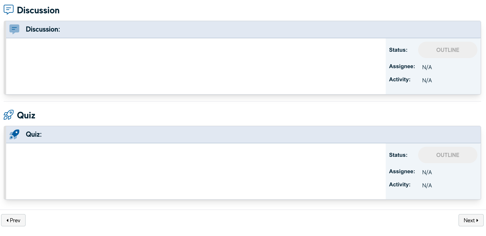
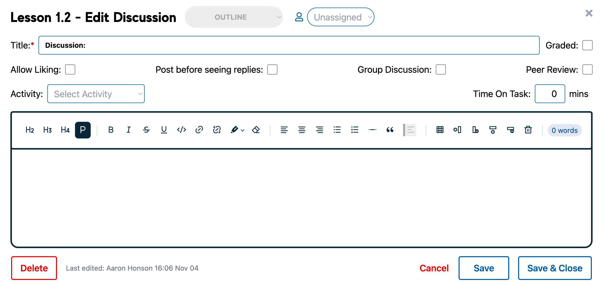
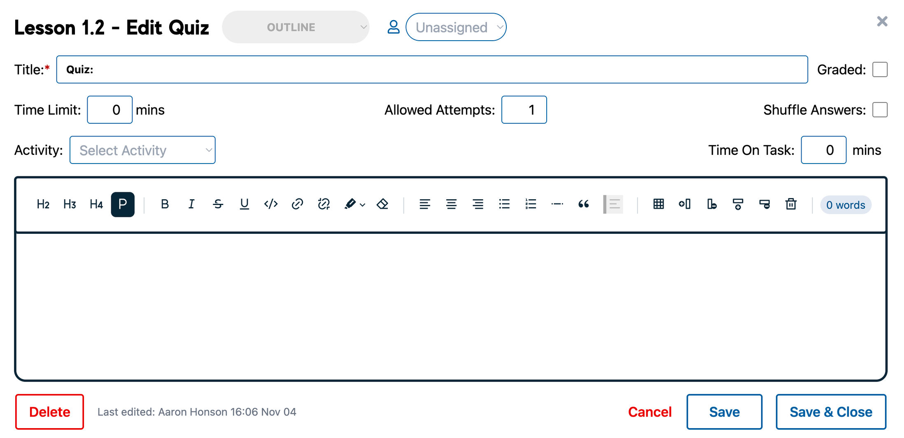

# Quizzes & Discussions

Discussions and Quizzes are added through the Lesson view page:

To add Discussions or Quizzes to a Lesson, click on the + Discussion/Quiz button and select the type you would like to add. Discussions and Quizzes are displayed below the Block content on each Lesson.

Discussion and Quiz Blocks can be edited by clicking on them from the Lesson view, and are done through very similar processes to the Lesson Blocks themselves.

## Editing a Discussion

Discussions uses the Block editor view, with a few extra options:

|Option|Description  |
|--|--|
| Graded | Whether this activity contributes to the student’s final grade |
| Allow Liking | Whether students can ‘like’ another student’s posts |
| Post before seeing replies | Students are required to post before they can see any responses to the initial post |
| Group Discussion | If this is a group discussion, this is a discussion board used by a particular group _inside Canvas_. |
| Peer Review | This sets a discussion as an activity where students are tasked with answering a prompt and then responding to/reviewing [x] number of other students' submissions |

Almost none of these affect anything inside SSB (except ‘graded’), but will inform the Course Build process.

## Editing a Quiz

As above, Quizzes use a modified Block editor view:

|Option|Description  |
|--|--|
|Graded  | Whether this activity contributes to the student’s final grade |
| Time Limit | If a time limit is set, this is how long a student can take to complete the quiz |
| Allowed Attempts | How many times a student can take/retake the quiz |
| Shuffle Answers  | If this is selected, the answers for each question are in a random order |

