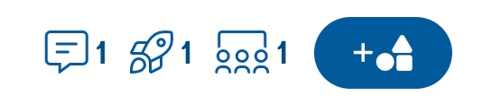
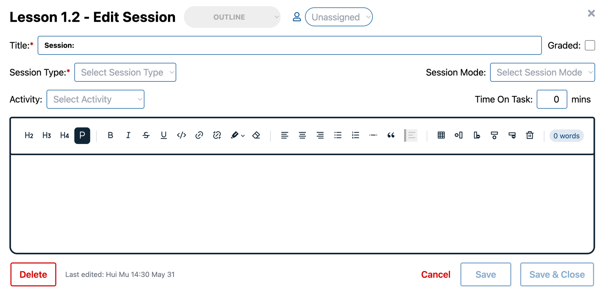
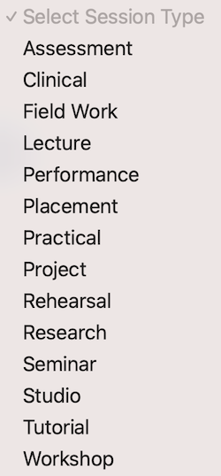
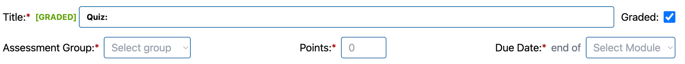

# Discussions, Quizzes, and Sessions

Discussions, Quizzes, and Sessions are added through the Lesson view page:

To add Discussions, Quizzes or Sessions to a Lesson, click on the + Discussion/Quiz button and select the type you would
like to add. Discussions and Quizzes are displayed below the Block content on each Lesson.

The icons displayed next to the button show the total number of Discussions, Quizzes and Sessions within the lesson. To
quickly navigate to the Discussion/Quiz/Session section in the lesson, you can click on the respective icon.

Discussion and Quiz Blocks can be edited by clicking on them from the Lesson view, and are done through very similar
processes to the Lesson Blocks themselves.

## Editing a Discussion

Discussions uses the Block editor view, with a few extra options:

| Option                     | Description                                                                                                                                                        |
|----------------------------|--------------------------------------------------------------------------------------------------------------------------------------------------------------------|
| Graded                     | Whether this activity contributes to the student’s final grade                                                                                                     |
| Allow Liking               | Whether students can ‘like’ another student’s posts                                                                                                                |
| Post before seeing replies | Students are required to post before they can see any responses to the initial post                                                                                |
| Group Discussion           | If this is a group discussion, this is a discussion board used by a particular group _inside Canvas_.                                                              |
| Peer Review                | This sets a discussion as an activity where students are tasked with answering a prompt and then responding to/reviewing [x] number of other students' submissions |

Almost none of these affect anything inside SSB (except ‘graded’), but will inform the Course Build process.

## Editing a Quiz

As above, Quizzes use a modified Block editor view:

| Option           | Description                                                                      |
|------------------|----------------------------------------------------------------------------------|
| Graded           | Whether this activity contributes to the student’s final grade                   |
| Time Limit       | If a time limit is set, this is how long a student can take to complete the quiz |
| Allowed Attempts | How many times a student can take/retake the quiz                                |
| Shuffle Answers  | If this is selected, the answers for each question are in a random order         |

## Editing a Session

As above, Sessions use a modified Block editor view:

| Option       | Description                                                                                                  |
|--------------|--------------------------------------------------------------------------------------------------------------|
| Graded       | Whether this activity contributes to the student’s final grade                                               |
| Session Type | The type of session is a required field in the editor. List of types includes:  |
| Session Mode | Set the mode of session to be Online, Hybrid, or Face-to-face                                                |

## Graded discussion/quiz/session

If the ‘Graded’ option is checked, 3 additional fields are required for discussion/quiz/session. They are Assessment
Group (needs to be set up in Assessment view first), Points, and Due Data.

