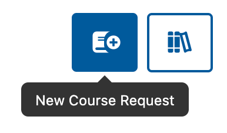
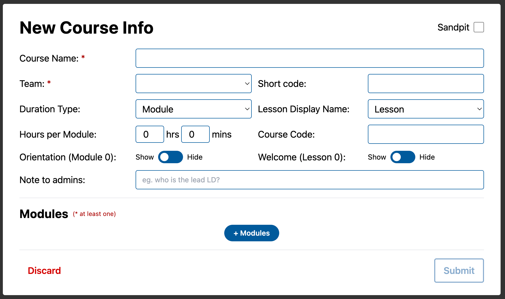
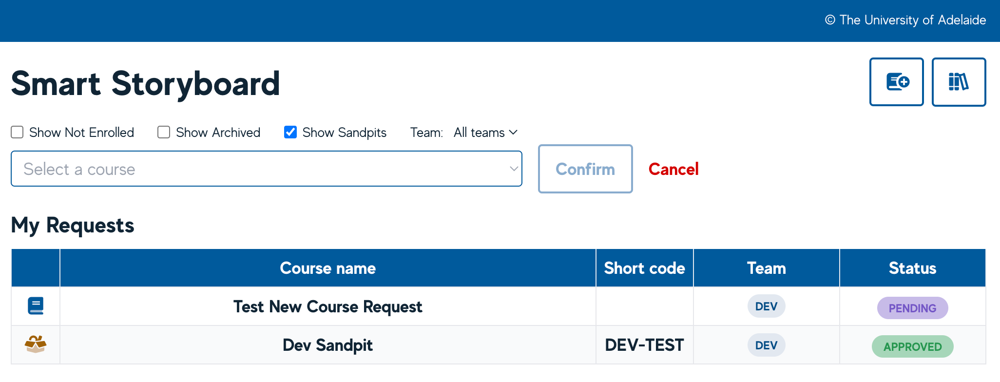

# Requesting a new course

All users have the ability to **request a new course** in the Smart Storyboard. This can be done from the Dashboard by selecting the **‘Change Course’** button, and then the **‘New Course Request’** button which will appear in the top right corner.

From here, all relevant **New Course Info** can be added, including Course Name, Team and number of Modules/Weeks (in addition to other course settings). Each new course request will then go into a queue for the Media team to approve (or address any issues) which we expect will take no longer than 24 hours. Users are also able to add a new course as a Sandpit if required by using the checkbox.

_**Note: you will only be able to create courses for Teams that you are already part of.**_

## List of your requests

On the **Dashboard**, you will be able to see your **Pending** and **Approved** course requests.

