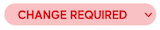
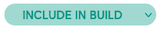

# Media Asset Status

Each media asset is issued with a status dropdown. This is used to move media assets through the Learning Design and
Development process, and identify the current action required for the asset.

This guide covers the use of each status dropdown for Media and Video, and who is responsible for each stage.

It is important to note that a Video Asset is still classed as a Media Item, so will have its own Media status dropdown
to move through the production process. Any associated video graphics will still be listed inside the Media Asset
Registry and use the same process.

:::infoNote
Media Asset status can only be changed from within the Media Asset Registry.

Video Production status can be changed from within the Media Asset Registry or the Video Production Storyboard Media
List.
:::

## Media Status Dropdown

| Status               | Dropdown                                      | Description                                                                                                                                                                                         | Responsibility |
|----------------------|-----------------------------------------------|-----------------------------------------------------------------------------------------------------------------------------------------------------------------------------------------------------|----------------|
| **Backlog**          |  | The default status for an asset. If an asset is assigned ‘Backlog’, this asset will not be touched by Media Production.                                                                         | LD / DED       |
| **To Do**            |        | Media asset is ready for Media Production to action. Media Production will not begin work on any assets that are not assigned ‘To Do.’                                                          | LD / DED       |
| **Doing**            |       | Asset is actively being worked on by a member of Media Production.                                                                                                                                  | LMP            |
| **Change Required**  |      | Media asset requires changes. This could be used to reference late changes to an asset, or a correction of a spelling error.                                                                    | LD / DED       |
| **Done**             |        | Media Production have completed work on an asset and it is ready to be placed in-platform.                                                                                                          | LMP            |
| **Include in Build** |       | This media asset has been identified as something best built in the course instead of a bespoke asset. This is most commonly used for tables that need to be created in HTML for accessibility. | DED            |
| **In Platform**      |    | Asset is complete and already uploaded to the LMS.                                                                                                                                                  | DED            |

## Media Asset Assignee Dropdown

| Assignee                                        | Description                                                                                                                 | Responsibility |
|-------------------------------------------------|-----------------------------------------------------------------------------------------------------------------------------|----------------|
|  | The default status for an asset. If an asset is assigned ‘Backlog’, this asset will not be touched by Media Production. | LD / DED       |

## Video Production Status Dropdown

| Status                | Dropdown                                    | Description                                                                                                                                                                                                                                          | Responsibility |
|-----------------------|---------------------------------------------|------------------------------------------------------------------------------------------------------------------------------------------------------------------------------------------------------------------------------------------------------|----------------|
| **Backlog**           |  | This asset has been identified during the writing of the video.                                                                                                                                                                                      | LD             |
| **To Do**             |        | Media asset is ready for Video Production to action. Media Production will not begin work on any assets that are not assigned ‘To Do.’                                                                                                           | LMP            |
| **Waiting on Assets** |     | Assets are required for the video item during post-production. Post-production has halted and is waiting on assets.                                                                                                                              | LMP            |
| **Doing**             |       | The production of this video is currently underway.                                                                                                                                                                                                  | LMP            |
| **Wipster Review**    |     | The first version of the asset has been completed and is sitting on Wipster for review.                                                                                                                                                              | LD             |
| **Change Required**   |      | Changes were identified during Wipster Review and comments have been made ready for LMP to action.                                                                                                                                                   | LMP            |
| **Done**              |        | The video is complete and ready to add to the course.                                                                                                                                                                                                | LMP / DED      |
| **Include in Build**  |       | This media asset has been identified as something best built in the course instead of a bespoke asset. This status is not commonly used within Video Production, but can be used to identify videos that need to be converted into page content. | DED            |
| **In Platform**       |    | The asset has been uploaded to Echo360 and embedded in the course in the correct location.                                                                                                                                                           | DED            |

## Video Assignee Dropdown

| Assignee   | Description                                                                                 | Responsibility |
|------------|---------------------------------------------------------------------------------------------|----------------|
| Storyboard | Used to identify which Learning Designer is responsible for the creation of the storyboard. | LD             |
| Video      | Used to identify which member of LVP is responsible for the post-production of the video.   | LMP            |