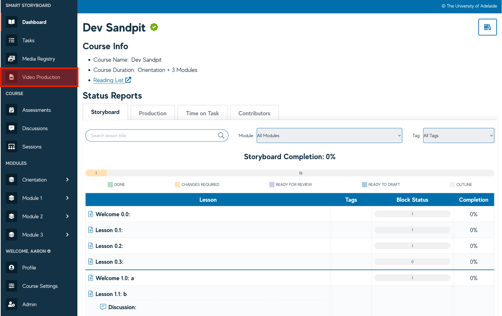
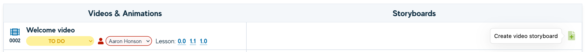
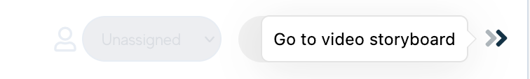
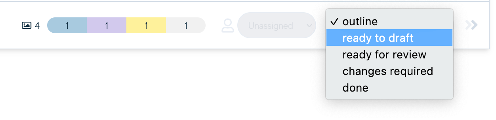
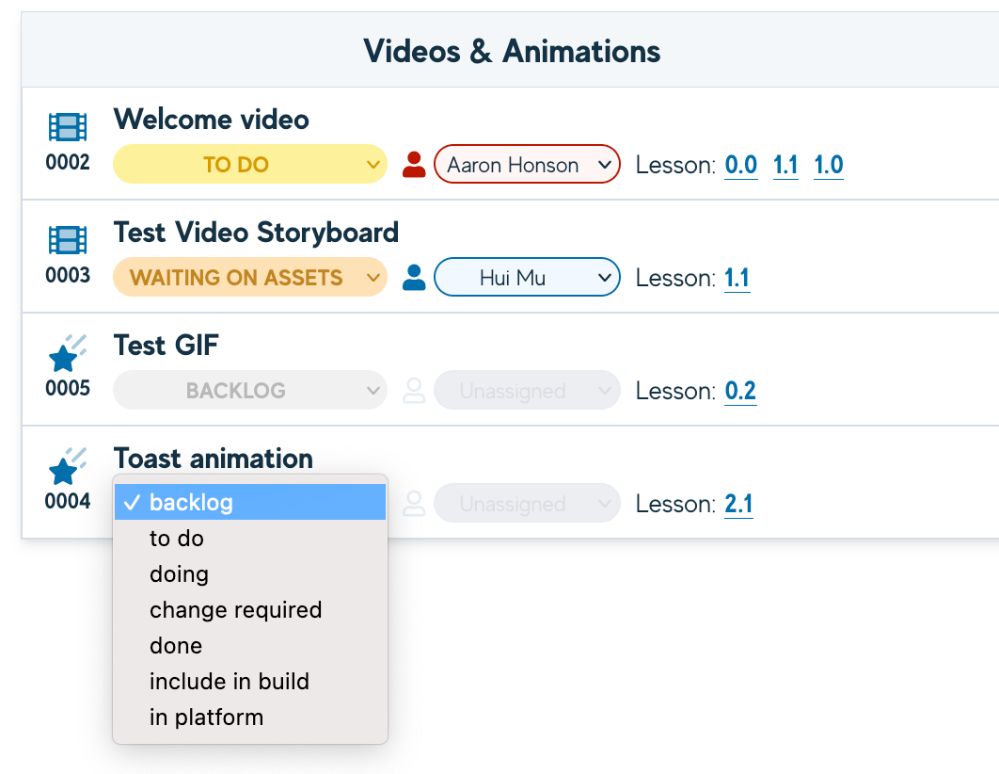
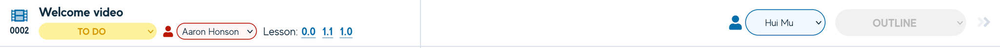
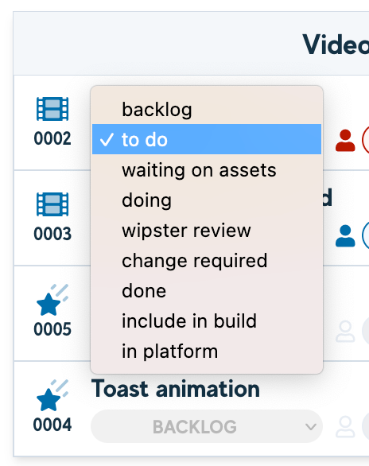
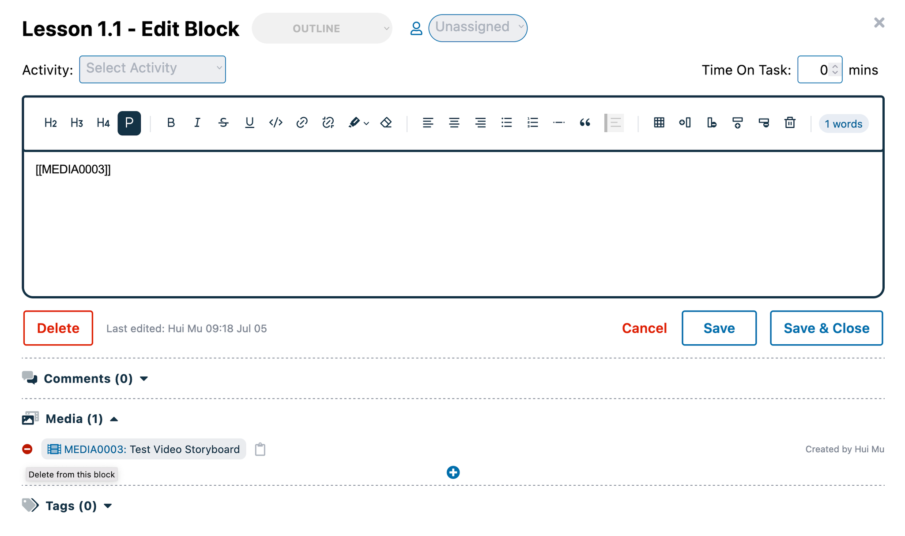
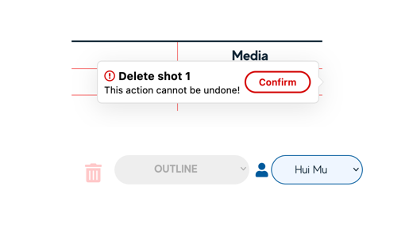
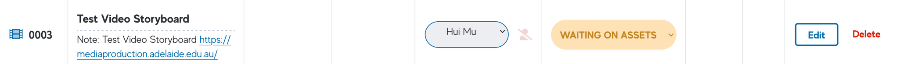

# Video Production Storyboarding

Video Production view has now been added to the Smart Storyboard. This view can be used to see videos and animations in
the course, create new storyboards for a video, update their status, and navigate to each “storyboard” as needed. This
introductory page will cover how to find this new view, how to create your new video storyboard and how to assign
statuses.

## Creating a new Storyboard

To create a new storyboard for a video or animation listed, click on the +doc icon to the right of the item listed from
the Video Production view. This establishes the item as a video or animation that requires the storyboarding
functionality to be enabled.

Now, you can navigate through to that storyboard by clicking the double Arrows to the right of each item row.

## Storyboard Statuses

Each video storyboard will be issued with a Block status dropdown - this can be used to move video storyboard through
the Learning Design and Development Process. The status can be changed from the Video Production view, as well as from
within the Storyboard itself.

These statuses mirror the Block status from the Lesson view and work much the same way:

| Status           | Responsibility    | Description                                                                                                                                      |
|------------------|-------------------|--------------------------------------------------------------------------------------------------------------------------------------------------|
| Outline          | Learning Designer | The broad outline or brief is being written and largely sits with the Learning Designer                                                          |
| Ready to Draft   | SME/Author        | The full draft of the script is being written or is ready to be written by the SME or Author of the course (or the talent starring in the video) |
| Ready for Review | Learning Designer | The content is complete in a draft state and has been flagged for an LD to review it.                                                            |
| Changes Required | SME/Author        | An LD has flagged changes are required for the SME/Author to address.                                                                            |
| Done             | -                 | The content writing is complete and this is considered Done.                                                                                     |

It’s important to note that a Video is still classed as a Media Item, and so will have its own Media status dropdown to
move it through the production process. These appear differently in the Video Production view and have limitations on
their use - however, the Media status will operate as normal from the Media Registry.

Both the Video and the Storyboard of that same video, can have different assignees.

:::infoNote:
 The status options for a Video media item has been updated to reflect the production process.
:::

Explanations of the status dropdown options can be found in detail in <a href="../using-ssb/status">Media Asset Status</a>

## Adding and Removing Video Storyboards

Videos that have Storyboards enabled can be added and removed from any Block within the Smart Storyboard. To completely
remove a Video and its Storyboard, you will first need to remove the Video media item from the Block where it was added.

Next, the Storyboard itself will need to have any Shots removed. This will allow the Delete Storyboard button to become
active.

Once the Storyboard has been deleted, the Video media item can then be deleted from the Media Registry.

