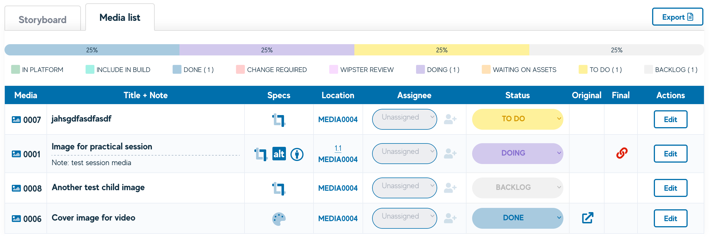
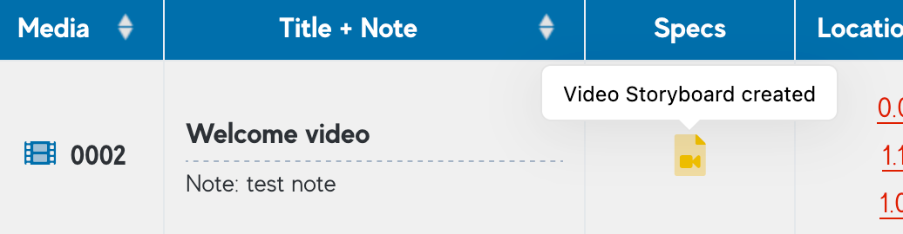
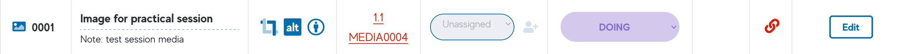
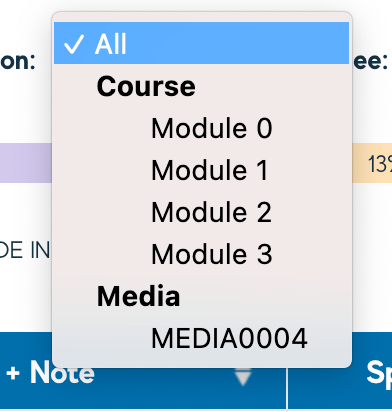

# Storyboards and Media Assets

Videos can now have media items nested within them - meaning a video can have images or animations attached to them.

Each item will have its own status and workflow, but will appear nested from the Video Production view. This also means that a nested media item will have a course location of the video, rather than a page. _eg. MEDIA0011 rather than 1.2._

When a video storyboard has nested items, they will appear against that row in the Video Production view and will display each of their statuses which is pulled from the Media Registry.

## The Media List tab

The Media List exists in each Video Storyboard and will summarise the nested media for each Video item. The list appears similar to the Media Registry and will be used by media staff to work through the required assets against each video. Statuses and Assignees here will be reflected in the Media Registry and visa versa.

## The Media Registry

If a video has had a Storyboard created, it will now display a Video Storyboard created icon in the Specs column within the Media Registry for each course.

Items that have been added to a video storyboard will now show the Video ID as its location, this link will navigate to the Video Storyboard, rather than the page where the Video belongs in the course.

The Location filter dropdown now allows users to filter by two groups:

- **Course** - users can filter media by Module/Week/Section

- **Media** - users can filter nested media by the parent media they belong to

