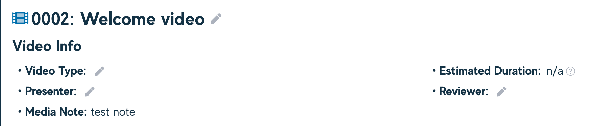
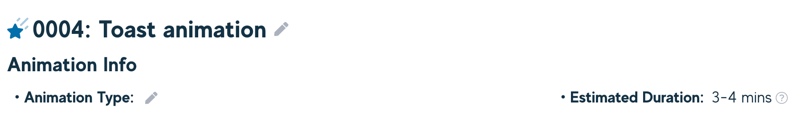
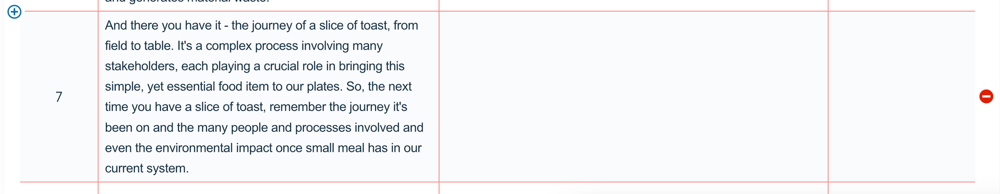
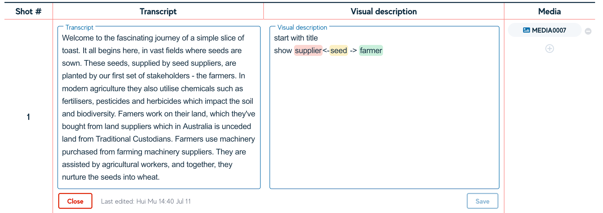
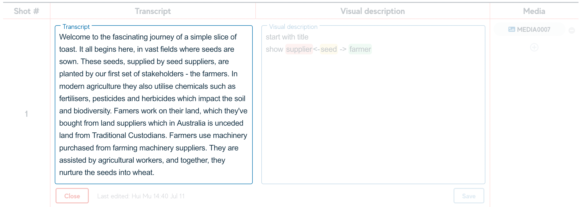
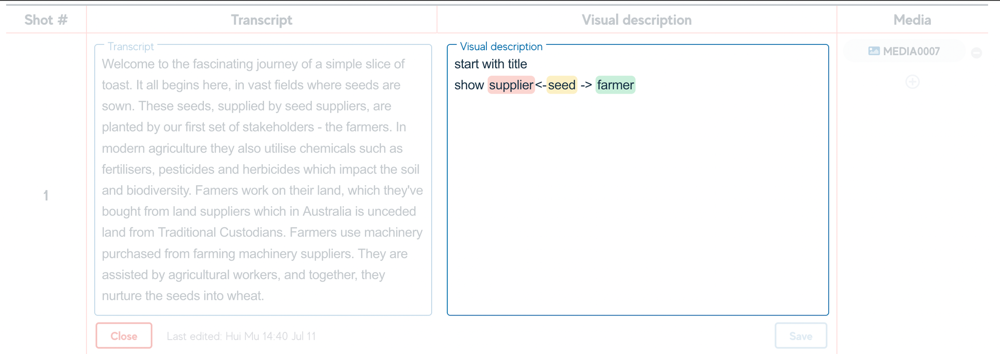
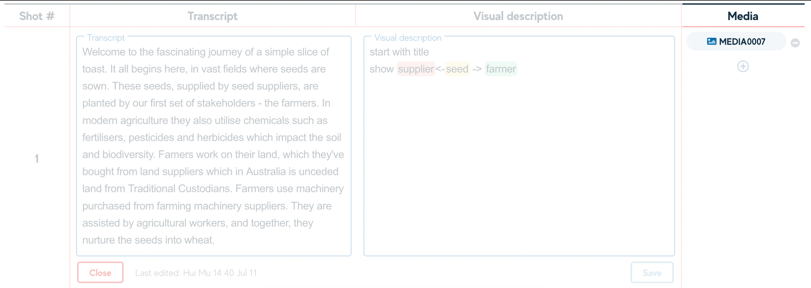
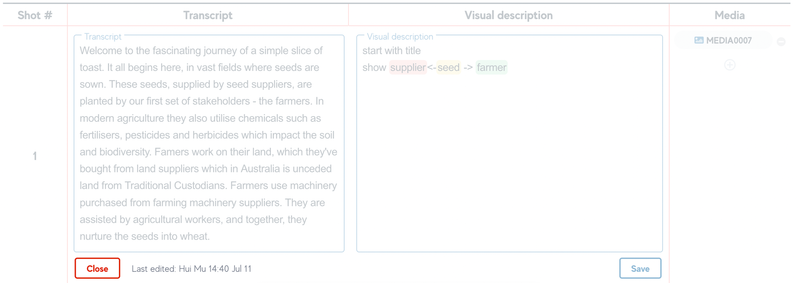
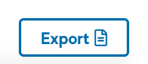
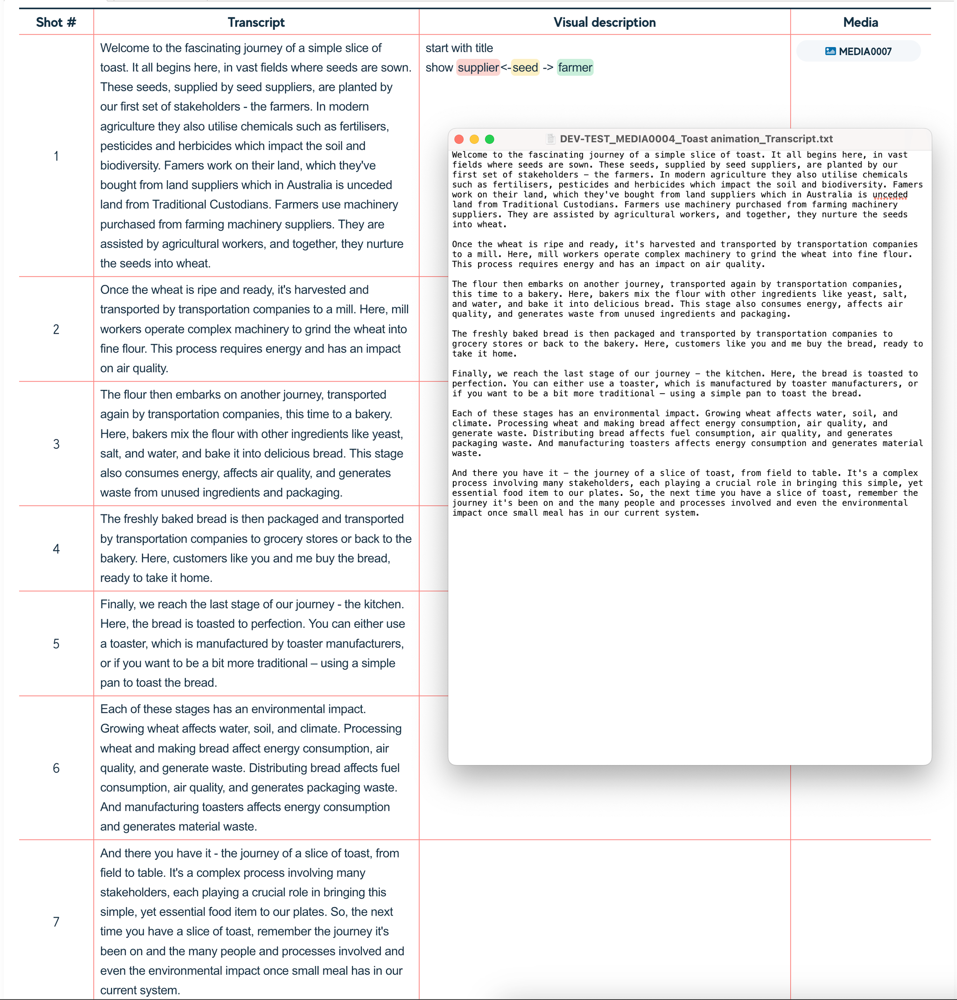

# Writing your video storyboard

Each Video Storyboard has a number of fields that can be populated from within the Storyboard view. These include:

- **Video Type** - intended to capture the type of video. Eg. Talking head, or Interview.

- **Presenter** - the presenters name who will be in the video or narrating

- **Reviewer** - who needs to review/approve the video

:::note

- The Video title can be changed from the Storyboard view and will be reflected in the Media Registry.

- The Media Note is pulled from the Media Registry, but can not be changed in this view.

- The Estimated Duration is calculated based on the word count and average reading speeds.

:::

## The Storyboard tab

The Storyboard Tab is the primary view for writing and tweaking your video storyboard. The Storyboard tab is broken down into 4 columns, these are:

- **Shot ID** - an auto-populated row ID starting at 1, the Shot ID reflects the order in which the content will be displayed

- **Audio (transcript)** - the words that will be said by the presenter in each Shot, and likely used in the teleprompter in the recording studio

- **Visual (on screen)** - a description for each Shot of what is happening on screen, including instructions for media team

- **Media** - media items that belong to and appear in each Shot

### Shots

A shot is a sequence of action on the screen aligned with the content from the presenter. This may be a short sentence or a longer series of sentences but broadly we use this to describe what happens on screen during what is being said in easily digestible chunks.

Shots can be added using the + icon to the left of screen, and can be deleted from the right of screen using the delete button. New Shots can be added between existing shots, or at the start or end.

To edit a Shot, a magnifying glass mouse pointer will appear on hover, click on the Shot you want to edit. **Note: you can only edit 1 shot at a time and will need to save or close before moving on.**

The Audio (transcript) field is a pure text-input field with no formatting. This box is intended to capture the words being said in each Shot.

The Visual (on screen) field allows for some basic formatting by selecting the text you would like to modify via a floating menu, and includes some basic formatting and highlighting tools.

Media can be added to each Shot by using the + icon in the Media column, which will display the same Media modal popup seen throughout the Smart Storyboard tool. New and Existing media can be added from this view, but only Images and Animations will be available.

Once a Media item has been added, it will be visible in the Media column and a quick preview is available on hover. The item can be removed from the Shot by clicking on the Remove button against that item.

Once you are done editing a Shot, you will need to click Save before editing a new Shot, or leaving the Storyboard view. Clicking Close will discard your changes to the Audio and Visual fields, however Media will remain allocated.

## Exporting your transcript

To Export the Transcript of into a pure text file, click on the Export button to the top right of the Storyboard view. This file can be used to generate Transcript text and used in the Teleprompter. The file will save to your local computer as a .txt file.

  

